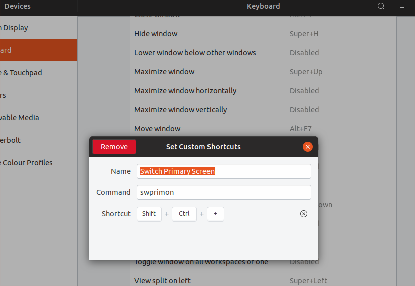
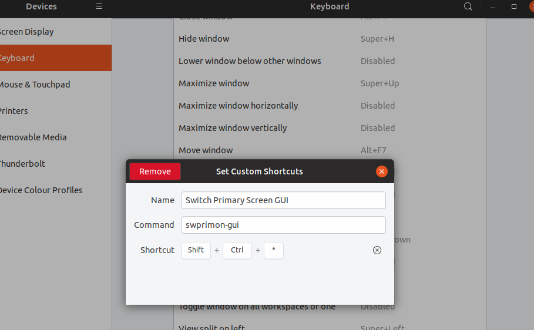

# Switch primary monitor
<p align="center">

</p>

## Description
Switch primary screen between any number of monitors with interactive option

## Requirements
- bash
- xrandr
- notify-send

## Setup
`cp swprimon.sh ~/.local/bin/swprimon`

Note: make sure `~/.local/bin/` exists and in PATH

## Usage
- **Interactive:** `SWPRIMON_INT=1 swprimon`
  ```
  > SWPRIMON_INT=1 swprimon
  select new primary monitor:
  - *XWAYLAND2
  - XWAYLAND0
  - XWAYLAND1
  Enter Monitor name:
  ```
- **Non-Interactive:** Set keboard shorcut from Settings -> Devices -> Keyboard -> +
  
  <p align="center">
  
  </p>

  <p align="center">
  
  </p>


  